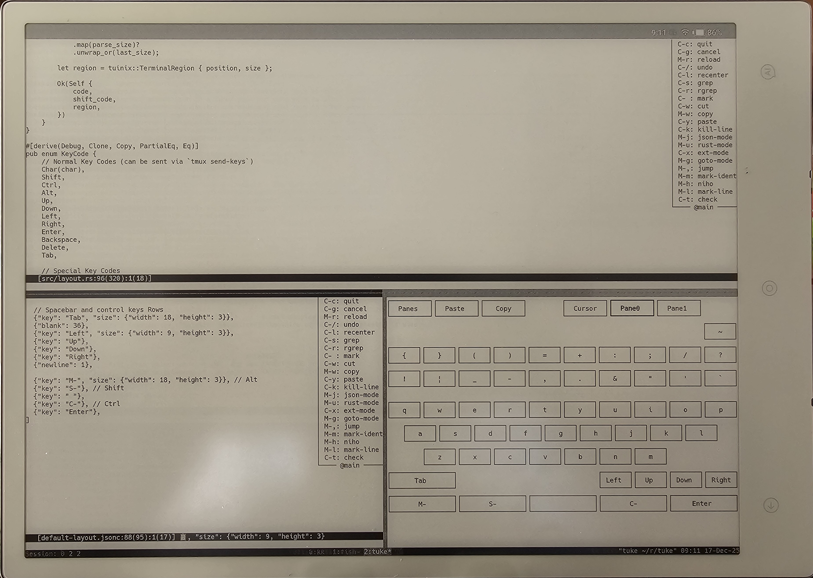

tuke
====

A proof of concept of **TU**I **KE**yboard for tmux.



```console
$ cargu run

// or

$ cargo install --path .
$ tuke
```

Motivation:
- coding friendly keyboard for termux (run on a tumux pane and send keys to other panes)
- e ink / termux friendly keyboard
- easily setup / customizable (don't want develop android app)
- flexible layout (jsonc)

Limitations by design:
- cannot use with tumux popup window
- keep the same keyboard between tmux windows (sesions?)
- show cursor on the destination pane
