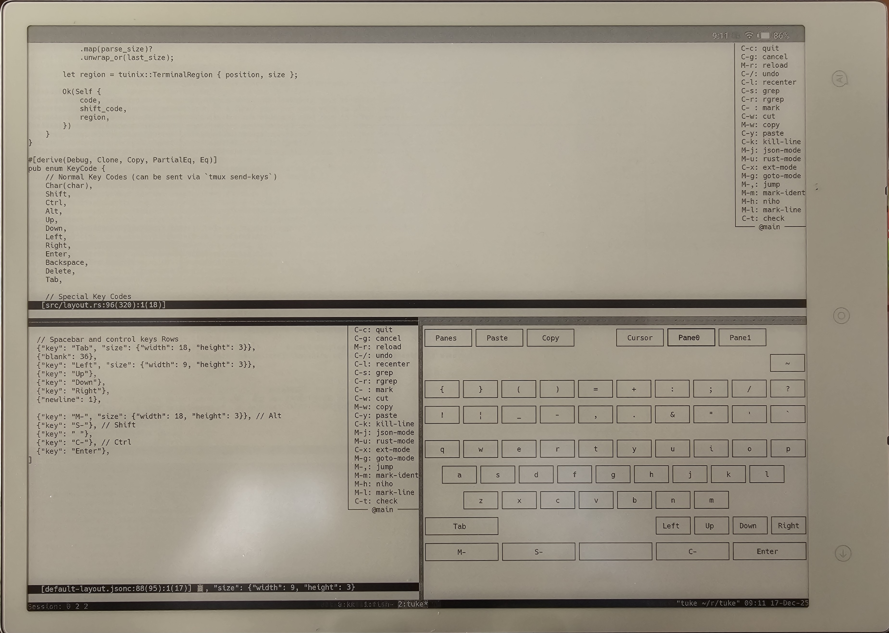

tuke
====

A proof of concept of **TU**I **KE**yboard: a software keyboard that drives
another process in a PTY.



tuke shows a program (the shell by default) in the top of the terminal and a
mouse-driven software keyboard below it. Clicking a key sends the corresponding
key to that program's PTY.

How to Run
----------

```console
$ cargo run

// or

$ cargo install --path .
$ tuke
```

Run a specific command instead of `$SHELL -l`:

```console
$ tuke --command 'vim'
```

Features
--------

- Embeds one child process in a PTY and drives it (no tmux required)
- Software keyboard that turns mouse clicks into key presses
- Configurable key layout (see: [layouts/default.jsonc](layouts/default.jsonc))
- Shortcut keys that type a configured string (see: [layouts/mini-left.jsonc](layouts/mini-left.jsonc))
- Host keys and pastes are forwarded to the child untouched

Limitations
-----------

- A single session only (no panes, windows, or sessions)
- The keyboard reserves the bottom rows of the terminal for itself
- The layout is chosen once at startup

Layouts
-------

A layout is a JSONC file that places keys at absolute coordinates inside the
keyboard region. Three are shipped:

| File | Size | Notes |
| --- | --- | --- |
| [layouts/default.jsonc](layouts/default.jsonc) | 144 cols | The full three-region keyboard |
| [layouts/compact-right.jsonc](layouts/compact-right.jsonc) | 144 cols | Same, narrower clusters |
| [layouts/mini.jsonc](layouts/mini.jsonc) | 69 cols | Fits in 80 columns; the keys a shell needs plus the arrows, no Shift/Alt |

The file to load is currently hard-coded, so `mini.jsonc` is not reachable yet.

A key also does more than send: it can switch layouts. A key whose `key` is
`{"switch_to": NAME}` instead of a code shows the layout named `NAME` in the
same file. A file can declare more than one layout, with `{"layout": NAME}`
starting a new one; a file that never does is a single layout named `default`.
The keyboard shows the first layout it declares.

```jsonc
[
  {"key": "a"},
  {"key": {"switch_to": "minimal"}},
  {"layout": "minimal"},
  {"key": {"switch_to": "default"}}
]
```

A `switch_to` may name a layout declared later in the file, but it must name
one the file declares somewhere: a name no layout uses is a load error, reported
at the name that spelled it. A switch that could never fire is a typo rather
than a key.

A key can also type a whole string, so a long command line is one press rather
than a dozen. The `key` is a `{"shortcut": …}` object with the string in `text`
and the name to draw on the key in `label` (the text is usually too long to
draw, so the label is required and the two are not derived from each other).
The text is typed the way pressing its keys would type it and carries no Enter,
so the user reads the line back and decides what happens next - a key that ran a
command outright could not be taken back when a thumb lands on it by accident.

```jsonc
{"key": {"shortcut": {"label": "tell", "text": "attini tell"}},
  "size": {"width": 7, "height": 3}}
```

To see what tuke reads out of a layout - every key's code, region, and label,
plus the keyboard's overall extent - run the [`inspect_layout`](examples/inspect_layout.rs)
example against it:

```console
$ cargo run --example inspect_layout layouts/mini.jsonc
```

That is also the worked example of reading a layout from Rust, and the extent
it prints is the number a layout chooser compares against the terminal size.

Roadmap
-------

What is planned next, in the order it is meant to happen.

### 1. Layout selection

Today the layout is loaded at startup and the terminal size only decides where
the keyboard is drawn, not which one. The next step is to let the terminal size
pick it. Three sizes exist; the small one must become reachable.

Agreed design:

- **Automatic switch (C).** A layout declares the smallest terminal it can be
  useful in, and tuke picks the largest layout that still fits. No key press is
  needed; resizing the terminal re-picks.
- **Manual switch (B).** Done: a `{"switch_to": NAME}` key shows another
  layout in the same file, so the choice is possible at any size.
- **Minimize (A).** A dedicated soft key hides the keyboard and hands the whole
  terminal to the child, toggling back on a second press.

Still open before the automatic switch: **how a layout declares the smallest
terminal it fits in.** A switch key needs nothing more than its target name,
which is settled; picking a layout by size needs each one to carry a size to
compare against.

### 2. Positional keyboard

A layout is currently a set of absolute coordinates, so an 80-column layout and
a 144-column layout cannot share one file and the keyboard can only be centred,
not aligned to where the hands are. A future format would place keys
positionally (rows of key widths) and let tuke compute the coordinates.

### 3. Notes

- The horizontal centring in [`src/geometry.rs`](src/geometry.rs) exists
  because layouts carry absolute columns; a positional format would make it
  unnecessary.
- `mini.jsonc` keys are five columns wide (only 69 of the 80 columns are
  used). `Esc`/`Tab` (9), `Ctrl` (9), `BSpace`/`Enter` (9) and the arrows (7)
  are wider so their labels fit and so the keys that are used most often are
  easier to hit.
